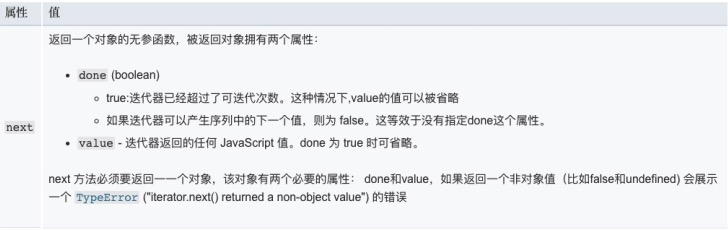
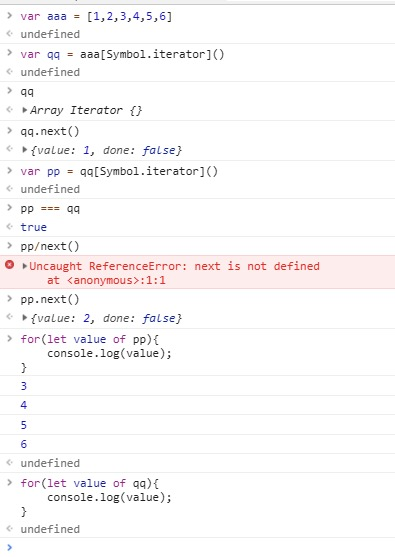

# 迭代器Iterator & 异步迭代器
##迭代器
> 任何一个对象。含有返回值为{done:true/false,value:xxx}的 next()函数  就认为是一个迭代器   
为各种不同的数据结构提供统一的访问机制，任何数据结构只要部署 Iterator ，就可以完成遍历操作    
ES6 规定，一个数据只要具有 Symbol.iterator 属性并且返回符合迭代器协议的对象时，就可以认为是“可遍历的”

### Symbol.iterator
> 是一个表达式，返回 Symbol 对象的 iterator 属性，是一个预定好的，类型为 Symbol 的特殊值。  
原生数据默认部署的有： Array Map Set String TypedArray 

###可迭代协议
> 允许 Javascript 对象去定义或定制它们的迭代行为

### 迭代器协议
> 定义了一种标准的方式来产生一个有限或无限序列的值，并且当所有的值都已经被迭代后，就会有一个默认的返回值。

当一个对象满足下述条件才会被认为是一个`迭代器`  
- 实现了一个 next() 方法并且拥有以下含义

### 遍历过程
1. 创建一个指针对象，指向当前数据结构的起始位置
2. 不断调用指针对象的 next 方法，每次调用都会返回数据结构的当前成员的信息
    
### 遍历- for...of...

## 异步迭代器
> 区别于 同步迭代器 的next 方法返回含有 value 和 done 属性的对象，而 异步迭代器 的 next 方法返回一个Promise 对象，并且 Promise 对象的值为含有 value 和 done 属性的对象

### 遍历- for...await...of
