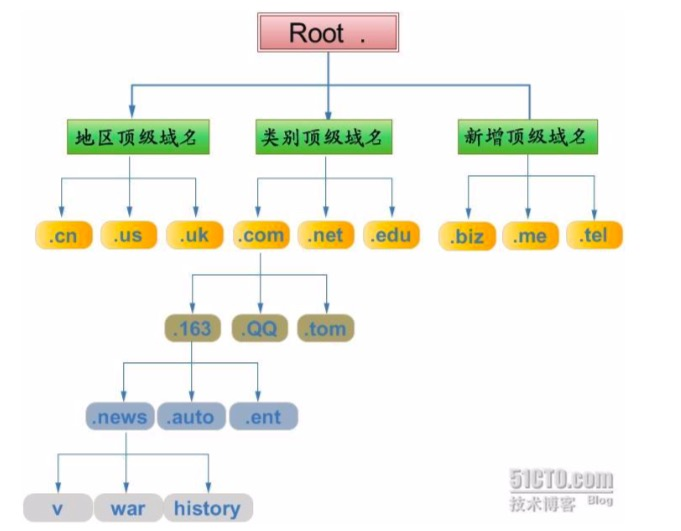

# DNS
> 域名解析系统：可进行域名与IP地址的转换  
书写域名：最低级开始直至顶级域名  
DNS查询或解析域名：从顶级域名开始至最低级域名

- 域名
  - 即 DomainName，由英文字母（不区分大小写），阿拉伯数字，及‘-’组成的字符。
  - 分为主体和后缀两部分，通过‘.’分割。
    - 后缀：默认空白

## 命名空间

- Root 根域名（.）
- 顶级域名
  - 地区顶级域名
  - 类别顶级域名
  - 新增顶级域名
- 二级域名（.com）
- 子域名：下一层为上一层的子域

## DNS 安全问题
- DNS 域名劫持
  - 修改了DNS的解析结果
- DNS 污染
  - 不经过DNS服务器，返回错误信息
- DOS 攻击
  - 故意的攻击网络协议实现的缺陷或直接通过野蛮手段残忍地耗尽被攻击对象的资源，目的是让目标计算机或网络无法提供正常的服务或资源访问，使目标系统服务系统停止响应甚至崩溃。
- DDOS攻击
  - 个人黑客没有能占全部带宽的网络，所以开发了分布式攻击，集合其他更多的网络带宽来同时对一个目标机发出大量攻击请求
  - 可能造成域名解析瘫痪

## DNS 优化
- DNS prefetching
  - 浏览器先尝试解析后在缓存
    1. 服务器响应设置`X-DNS-Prefetch-Control：on`启动与解析
    2. `<meta http-equiv="x-dns-prefetch-control" content="on">`
    3. `<link rel=”dns-prefetch” href=”//fonts.googleapis.com”>` 特定域名预解析
- 域名收敛
  - 减少DNS的请求
- HTTPDNS
  - 基于Http协议向HTTPDNS服务器发送域名解析请求，替代了基于DNS协议向运营商Local DNS发起解析请求的传统方式，可以避免运营商的域名劫持和进行精准调度。
    1. 客户端直接访问HttpDNS接口，获取业务在域名配置管理系统上配置的访问延迟最优的IP。（基于容灾考虑，还是保留次选使用运营商LocalDNS解析域名的方式）
    2. 客户端向获取到的IP后就向直接往此IP发送业务协议请求。以Http请求为例，通过在header中指定host字段，向HttpDNS返回的IP发送标准的Http请求即可。

