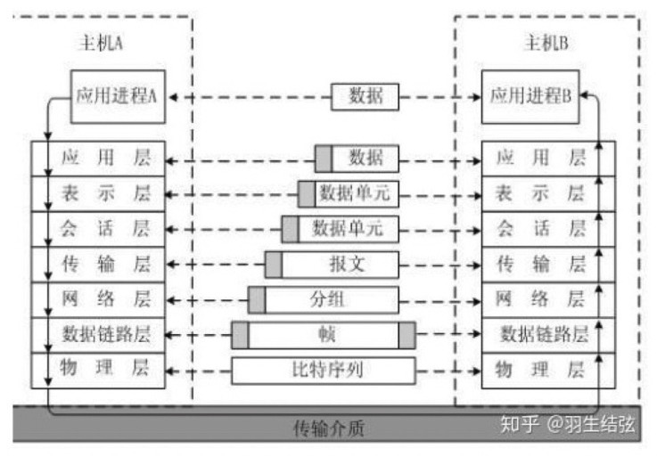

# [Http](https://developer.mozilla.org/zh-CN/docs/Web/HTTP/Overview)

> HTTP 本质是无状态的，使用 Cookie 可以创建有状态的会话

## OSI 七层协议

- 应用层 直接为用户的应用进程提供服务（HTTP,FTP）
- 表示层 数据格式标识，基本压缩加密功能。
- 会话层 控制应用程序之间会话能力；如不同软件数据分发给不同软件。
- 运输层 端到端传输数据的基本功能；如 TCP、UDP。（段）
- 网络层 定义 IP 编址，定义路由功能；如不同设备的数据转发。（包）
- 数据链路层 定义数据的基本格式，如何传输，如何标识；如网卡 MAC 地址。（桢）
- 物理层 底层数据传输，如网线；网卡标准。（比特流）

## TCP/IP 的体系结构

- 应用层（应用层+表示层+会话层）DNS，FTP，HTTP
- 传输层 TCP，UDP
- 互联网层 ICMP，IP
- 网络访问层（数据链路层+物理层）ARP，RARP

## HTTP 常见特性

- 缓存
- 开放同源限制：HTTP 可以通过修改头部开放限制
- 认证
- 代理和隧道
- 会话

## HTTP 流 - 难实现 - 已被 HTTP/2 的桢所取代

1. 打开一个 TCP 连接
2. 发送一个 HTTP 报文
3. 读取服务端返回的报文信息
4. 关闭连接或者为后续请求重用连接

当 HTTP 流水线启动时，后续请求可以不用等待第一个请求的成功。

## 基于 HTTP 的 APIs

- XMLHttpRequest
- Fetch API
- 服务器发送的事件，单向服务
  - 使用 EventSource 接口，客户端打开连接并建立事件处理程序。客户端浏览器自动将到达的 HTTP 流的消息转换为适当的 Event 对象，并将他们传递给已为事件 Event(注册的事件处理程序)。如果已知，或者 onmessage
