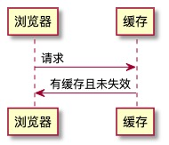
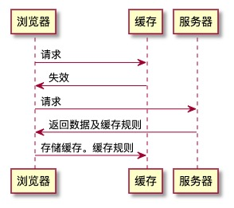
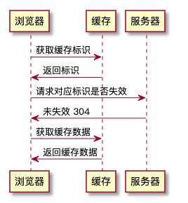
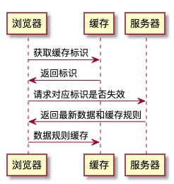

# Http 缓存（客户端缓存）

## 强缓存

### 缓存命中

### 缓存未命中

## 协商缓存

### 缓存命中

### 缓存未命中-标示 Etag

## 对比

- 强缓存
  - cache-control
    - public：客户端代理服务器都可缓存
    - private：客户端可缓存
    - max-age = t：t 秒后失效
    - no-cache：协商缓存
    - no-store：不缓存
- 协商缓存
  - 响应
    - lost-modified：服务器响应时，资源最后被修改的时间
  - 请求
    - if-modified-since：缓存中最后修改的时间
      - 服务器判断一致：返回 304
      - 服务器判断不一致：返回新的数据和规则 200
    - if-unmodified-since：以...时间开始是否有修改
      - 服务器未修改：返回 200 传送文件资源
      - 服务器修改：返回 412 预处理失败，不传送文件
    - 标识：Etag
      - 标识了资源的版本，之后可据此进行缓存以及询问服务器
        - 精确度： Etag > last-modified
        - 性能：Last-modified > Etag
        - 优先级： Etag > last-modified
